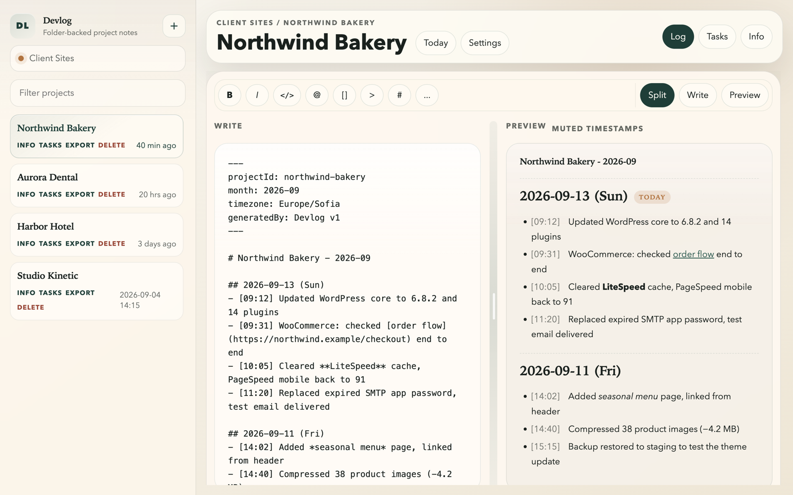

# Devlog

[](https://github.com/julianmarinov/DevLogger/releases/latest)
[](LICENSE)


Devlog is a Markdown work log organized by project, with a desktop app for macOS, Windows and Linux. Pick a project, type a line, move on. Every entry is saved as a plain Markdown file in a folder you choose, so your logs stay portable, easy to diff, and work with any sync tool (iCloud Drive, Dropbox, Syncthing, git).

It was built for keeping maintenance logs across many client websites, but it works for any project where you want a dated, timestamped record of what was done.



## Features

- One root folder, with a subfolder per project
- **Log**, **Tasks** and **Info** documents for each project
- Today's date heading is added automatically the first time you type each day
- Pressing Enter starts a new bullet stamped with the current time
- Monthly, daily, or single-file log partitioning
- Autosave, plus detection of external edits (reload or overwrite, never silently clobbered)
- Live Markdown preview (split, write, or preview view)
- Export a project as one combined Markdown file or as a zip archive
- Works offline, with no account and no telemetry

## Install

Download the latest build from the [Releases page](https://github.com/julianmarinov/DevLogger/releases):

| Platform | File |
| --- | --- |
| macOS (Apple Silicon) | `Devlog-<version>-mac-arm64.dmg` |
| macOS (Intel) | `Devlog-<version>-mac-x64.dmg` |
| Windows | `Devlog-<version>-win-x64.exe` |
| Linux | `Devlog-<version>-linux-x86_64.AppImage` |

The builds are not code-signed, so your OS will warn you the first time you open them:

- **macOS:** open the DMG and drag Devlog into Applications. Then right-click Devlog → **Open** → **Open**. If macOS says the app is "damaged", run `xattr -cr /Applications/Devlog.app` once in Terminal.
- **Windows:** in the SmartScreen dialog click **More info** → **Run anyway**.
- **Linux:** `chmod +x Devlog-*.AppImage`, then run it.

On first launch, click **Choose Root Folder** and pick (or create) the folder that will hold your logs.

## Keyboard shortcuts

`Cmd` on macOS, `Ctrl` on Windows/Linux.

| Shortcut | Action |
| --- | --- |
| `Cmd+P` | Filter projects |
| `Cmd+J` | Jump to today's section |
| `Cmd+F` | Find in the current note |
| `Cmd+B` / `Cmd+I` | Bold / italic |
| `Cmd+K` | Insert link |
| `` Cmd+` `` | Inline code |
| `Cmd+Enter` or `Alt+X` | Toggle a task checkbox |
| `Tab` / `Shift+Tab` | Indent / outdent |

## Folder layout

```text
My Logs/                  ← the root folder you choose
├── manifest.json         ← project list and last-edited times
└── acme-site/
    ├── project.json      ← name, log partition, date/time formats
    ├── tasks.md
    ├── info.md
    └── logs/
        └── 2026-09.md    ← or 2026-09-13.md (daily) or log.md (single file)
```

A log file looks like this:

```markdown
---
projectId: acme-site
month: 2026-09
timezone: Europe/Sofia
generatedBy: Devlog v1
---

# Acme Site - 2026-09

## 2026-09-13 (Sun)
- [09:12] Updated plugins, cleared cache
- [10:40] Fixed contact form SMTP settings
```

Existing folders that follow this layout are picked up automatically, and so are folders that just contain `logs/*.md`, `tasks.md` or `info.md`.

## Run from source

You need [Node.js](https://nodejs.org/) 20 or newer.

```bash
git clone https://github.com/julianmarinov/DevLogger.git
cd DevLogger
npm install
npm start
```

Development runs use a separate `Devlog-dev` settings profile, so they can run alongside an installed copy of the app. Pass `--user-data-dir=<folder>` to use a throwaway profile.

## Build installers

```bash
npm run build:mac     # DMG + zip (arm64 and x64) in dist/
npm run build:win     # NSIS installer
npm run build:linux   # AppImage
```

Each platform is best built on that platform.

## Publishing a release

Pushing a version tag triggers [`.github/workflows/release.yml`](.github/workflows/release.yml). It builds on macOS, Windows and Linux and uploads everything to a **draft** GitHub release:

```bash
npm version patch     # bumps package.json and creates a vX.Y.Z tag
git push --follow-tags
```

Review the draft on GitHub, then publish it.

## Browser version

Devlog also runs as a web app in Chromium-based browsers (Chrome, Edge, Arc, Brave), which support the File System Access API. Serve the folder with any static server:

```bash
python3 -m http.server 4173
```

Then open <http://localhost:4173>. Firefox and Safari can't write to local folders, so use the desktop app there.

## Notes

- Deleting a project permanently removes its folder. It does not go to the Trash.
- Logs are plain text: don't store passwords or secrets in them.

## License

[MIT](LICENSE) © Julian Marinov
